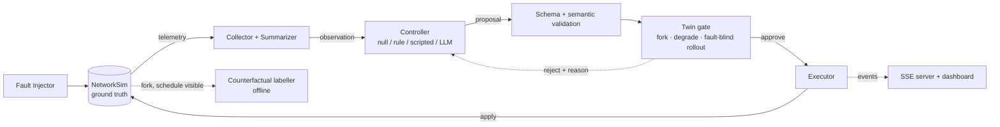

# Twin-in-the-Loop

**A deterministic testbed for measuring what a digital twin actually contributes when it vets autonomous repairs in an edge/IoT network.**


Autonomous controllers, including LLM agents, are increasingly proposed as network operators. A common safeguard runs every proposed repair on a digital twin first and applies it only if the predicted outcome is acceptable. Such gates are usually compared with an ungated agent, but that comparison cannot tell whether the benefit comes from the twin's *predictions* or simply from *blocking*.

Twin-in-the-Loop separates the two. It places a validation gate between a controller and a forkable network simulator, degrades the twin along controllable fidelity axes, labels **every** proposal (including rejected ones) with a paired counterfactual outcome, and compares the twin against reject-all, random, and schedule-aware gates.

---

## Contents

- [Highlights](#highlights)
- [Key findings](#key-findings)
- [Architecture](#architecture)
- [Repository layout](#repository-layout)
- [Installation](#installation)
- [Configuration](#configuration)
- [Quick start](#quick-start)
- [Running experiments](#running-experiments)
- [Reproducing the paper's analyses](#reproducing-the-papers-analyses)
- [Interactive demos](#interactive-demos)
- [Testing](#testing)
- [Documentation](#documentation)
- [Limitations](#limitations)
- [Citation](#citation)
- [Authors](#authors)
- [License](#license)

---

## Highlights

- **Deterministic, forkable simulator.** A discrete-time model of a 17-node edge network (1 gateway, 4 edge servers, 12 IoT devices, 6 services) with Poisson workloads, bounded queues and SLO tracking. `fork()` copies the full state, including RNG streams, so branches replay identical randomness.
- **Six composable faults.** CPU saturation, node crash, link degradation, link failure, memory leak and traffic surge, with seeded schedules shared across all experimental arms.
- **Closed, validated action space.** `migrate`, `restart`, `scale`, `reroute`, `throttle` and `no_op`, with realistic downtime costs. Every proposal passes schema, semantic and twin validation before it can touch the network.
- **Controllable-fidelity twin.** Observation noise, staleness, parameter drift, forecast error and queueing simplification, each independently configurable or driven by a single fidelity scalar. The twin is rolled forward *fault-blind*.
- **Paired counterfactual labels.** Every proposal is scored against a no-op branch that shares exogenous randomness, so the gate can be evaluated both as a classifier and by closed-loop SLO violations.
- **Interchangeable controllers.** Null, rule-based, scripted, and a LangGraph LLM agent that supports local (Ollama) and cloud (OpenAI-compatible, Gemini) models, with response caching and a hard budget guard.
- **Rigorous statistics.** Exact Wilcoxon signed-rank tests, Holm correction, bootstrap intervals and power analysis for small, zero-inflated paired samples.
- **Live observability.** A Server-Sent Events stream and browser dashboard show ticks, proposals, twin verdicts and ground truth as an episode runs.

## Key findings

Results from the corrected simulator (10 paired seeds, 120-tick episodes). See [`paper/main.tex`](paper/main.tex) and [`docs/research/`](docs/research/) for full details.

| Finding | Evidence |
|---|---|
| At full fidelity the twin is a near-perfect local filter. | Rule controller: 100% benefit preserved, 100% harm prevented. Scripted controller: 92.9% and 97.6%. |
| It cannot be distinguished from a reject-all gate at the episode level. | The rule controller's 4.4 violation-tick advantage comes from a single seed (exact Wilcoxon *p* = 1.000). |
| Blocking, not prediction, removes the scripted agent's harm. | Twin and reject-all are both ~29–30 violation-ticks better than ungated on 10/10 seeds (Holm *p* = 0.0215). |
| The null is explained by candidate composition. | Reject-all discards only 35 (rule) and 2 (scripted) violation-ticks of benefit across ten episodes, so even a perfect gate has ~17% power. |
| The unfaultable gateway is not an artifact of the gate results. | No proposal in ~9,200 ever migrated a service to the gateway. |

**Takeaway:** evaluations of twin-gated agents should report a reject-all control, per-seed distributions, and the benefit actually available to the gate, not just classifier accuracy.

## Architecture



At each decision tick, the gate forks the live simulator, degrades the copy to fidelity *f*, and rolls out the proposal and a `no_op` for *H* ticks without the future fault schedule. It approves if and only if

```
predicted_violations(action) − predicted_violations(no_op) ≤ τ
```

A rejection returns a reason to the controller, which may retry within a bounded budget; otherwise the system holds. An offline labeller repeats the comparison on the real simulator *with* the schedule visible. The labeller never influences the live episode.

## Repository layout

```
twin-in-the-loop/
├── src/twinloop/          Core library
│   ├── sim/               Discrete-time simulator, state, routing, metrics, fork
│   ├── faults/            Fault catalog, seeded schedules, injector
│   ├── telemetry/         Collector, SLO evaluation, agent-facing summarizer
│   ├── actions/           Action schema, semantic validator, executor
│   ├── agent/             Null, rule and LLM agents; LangGraph control graph
│   ├── llm/               Provider clients (local, cloud, Gemini), cache, budget guard
│   ├── twin/              Controllable-fidelity digital twin and gate
│   ├── experiment/        Arms, sweep runner, counterfactual labelling, logging
│   ├── diagnostics/       Privileged candidate enumerator (analysis only)
│   ├── analysis/          Result aggregation
│   ├── dashboard/         Episode driver, live SSE server, visualisation
│   └── config.py          Pydantic configuration models
├── configs/               YAML configurations (base, topology, experiments)
├── scripts/               Lab demos, experiment sweeps, ablations, live server
├── tests/                 pytest suite
├── app.py                 Streamlit dashboard
├── demo/                  Streamlit walkthrough of the simulator layers
├── review/                Self-contained interactive review page
├── docs/                  Architecture, reports, audits, research notes
├── paper/                 IEEE manuscript (main.tex)
└── results/               Generated runs, caches and figures
```

## Installation

**Requirements:** Python 3.11. [uv](https://docs.astral.sh/uv/) is recommended.

```bash
git clone <repository-url> twin-in-the-loop
cd twin-in-the-loop

uv venv --python 3.11
uv pip install -r requirements.txt
```

Activate the environment:

```bash
# Windows (PowerShell)
.venv\Scripts\activate

# macOS / Linux
source .venv/bin/activate
```

<details>
<summary>Without uv</summary>

```bash
python3.11 -m venv .venv
# activate as above, then:
pip install -r requirements.txt
```
</details>

## Configuration

Default simulator, topology, fault, twin and agent parameters live in [`configs/base.yaml`](configs/base.yaml).

API keys are only needed for LLM-driven runs. Copy the template and fill in the keys you use:

```bash
cp .env.example .env
```

| Variable | Used by |
|---|---|
| `LLM_API_KEY` | Generic OpenAI-compatible cloud provider (`--provider cloud`) |
| `GEMINI_API_KEY` | Gemini provider (`--provider gemini`), dashboard and live server |
| `OPENAI_API_KEY` | OpenAI preset (`--provider openai`) |

The scripts and dashboard load `.env` automatically. Never commit `.env`.

## Quick start

```bash
# 1. Verify the installation
uv run pytest -q

# 2. Watch the simulator run a seeded episode
uv run python scripts/lab1_network_demo.py

# 3. Run a small, fully offline experiment (no model or API key required)
uv run python scripts/run_experiments.py --arms A0,A1 --seeds 0,1
```

The lab scripts build up the system one layer at a time:

| Script | Demonstrates |
|---|---|
| `lab1_network_demo.py` | Simulator, topology and determinism |
| `lab2_fault_demo.py` | Fault injection and composition |
| `lab3_telemetry_demo.py` | Telemetry collection and SLO evaluation |
| `lab3b_llm_diagnosis_demo.py` | LLM diagnosis from summarized telemetry |
| `lab4_action_demo.py` | Action schema, validation and execution |
| `lab4b_rule_agent_demo.py` | Rule-based controller |
| `lab5_twin_demo.py` | Digital twin gate and fidelity |
| `lab6b_arm_comparison_demo.py` | Side-by-side arm comparison |

## Running experiments

`scripts/run_experiments.py` runs a resumable sweep over experimental arms and seeds.

| Arm | Controller | Twin gate |
|---|---|---|
| `A0` | Null (always `no_op`) | Off |
| `A1` | Rule-based | Off |
| `A2` | LLM | Off |
| `A3` | LLM | On, swept over fidelity levels |
| `A4` | Rule-based | On |

**Offline (default, deterministic).** A scripted provider stands in for the LLM, so no model is needed:

```bash
python scripts/run_experiments.py                              # full sweep
python scripts/run_experiments.py --arms A0,A1 --seeds 0,1     # quick smoke test
python scripts/run_experiments.py --dry-run                    # list runs without executing
```

**Local model via Ollama.** Start `ollama serve` and pull a model first. The default base URL points at `http://localhost:11434/v1`.

```bash
python scripts/run_experiments.py --provider local --model qwen2.5:7b-instruct
```

**Cloud model.**

```bash
# Gemini preset (reads GEMINI_API_KEY)
python scripts/run_experiments.py --provider gemini --arms A0,A1,A2,A3,A4 --seeds 0,1

# OpenAI preset (reads OPENAI_API_KEY)
python scripts/run_experiments.py --provider openai

# Any OpenAI-compatible endpoint (reads LLM_API_KEY)
python scripts/run_experiments.py --provider cloud \
  --base-url https://api.openai.com/v1 --model gpt-4o-mini
```

**Common options**

| Option | Description |
|---|---|
| `--arms` | Comma-separated arm IDs |
| `--seeds` | Comma-separated seeds |
| `--fidelity-levels` | Comma-separated fidelity values for `A3` |
| `--episode-ticks` | Override episode length |
| `--output` | Output directory (default `results/sweep`) |
| `--model`, `--base-url`, `--api-key-env` | Override provider settings |
| `--no-resume` | Re-run completed runs instead of skipping them |
| `--dry-run` | Print the run plan only |

## Reproducing the paper's analyses

The gate ablation compares ungated, reject-all, random, twin@{0.0, 0.6, 1.0} and schedule-aware gates for the rule and scripted controllers. Each condition takes about 7 minutes.

```bash
# Primary condition: seeds 0–9, gateway immune
python scripts/gateway_uncertainty_ablation.py run --workdir runs/default --output default.json

# Gateway faultable
python scripts/gateway_uncertainty_ablation.py run --gateway-faultable --workdir runs/faultable --output faultable.json

# Seeds whose schedule places a fault on the gateway
python scripts/gateway_uncertainty_ablation.py run --seeds 24,49,54,60,65,69,73,75,77,84 \
  --workdir runs/exposed_default --output exposed_default.json
python scripts/gateway_uncertainty_ablation.py run --gateway-faultable --seeds 24,49,54,60,65,69,73,75,77,84 \
  --workdir runs/exposed_faultable --output exposed_faultable.json

# Statistics: exact Wilcoxon, Holm, t and bootstrap intervals, power
python scripts/gateway_uncertainty_ablation.py analyze \
  --default default.json --faultable faultable.json --output stats.json

# Candidate composition: benefit preserved vs. harm prevented
python scripts/candidate_composition.py \
  --ablation published=default.json --ablation faultable=faultable.json \
  --output composition.json
```

Write-ups of these analyses:

- [`docs/research/uncertainty_and_gateway_ablation.md`](docs/research/uncertainty_and_gateway_ablation.md)
- [`docs/research/candidate_composition.md`](docs/research/candidate_composition.md)
- [`docs/research/audit_fix1.md`](docs/research/audit_fix1.md): simulator corrections and opportunity-gap analysis

## Interactive demos

**Streamlit dashboard.** Run instrumented episodes and compare arms:

```bash
streamlit run app.py
```

**Simulator walkthrough.** Topology, telemetry, fault timeline, the agent's view, and determinism:

```bash
streamlit run demo/review1_app.py
```

**Interactive review page.** A self-contained page covering every level of the project, with figures produced by the project's own code. Open [`review/index.html`](review/index.html) directly in a browser.

To enable its **Run it live** section, which streams ticks, prompts, model replies, twin forecasts, verdicts and ground truth as an episode runs, start the local server and open the address it prints:

```bash
python scripts/live_server.py            # http://127.0.0.1:8765/
python scripts/live_server.py --port 9000
```

> The live server uses only the standard library, binds to localhost, runs one episode per request and has no authentication. It is a demo, not a production service.

## Testing

```bash
uv run pytest -q                        # full suite
uv run pytest -q -W error               # treat warnings as errors
uv run pytest tests/test_twin.py -q     # a single module
```

| Area | Modules |
|---|---|
| Simulator and determinism | `test_sim`, `test_sim_boundaries`, `test_fork`, `test_seeding` |
| Faults and telemetry | `test_faults`, `test_telemetry` |
| Actions and validation | `test_actions`, `test_boundary_validation`, `test_recovery_validity` |
| Twin and agents | `test_twin`, `test_agents`, `test_graph`, `test_llm_agent`, `test_llm_finalization`, `test_provider_deadlines` |
| Experiments and dashboard | `test_experiment`, `test_dashboard`, `test_live` |

## Documentation

| Document | Contents |
|---|---|
| [`docs/architecture.md`](docs/architecture.md) | System design and component responsibilities |
| [`docs/build_plan.md`](docs/build_plan.md) | Level-by-level build plan |
| [`docs/decisions/`](docs/decisions/) | Architecture decision records |
| [`docs/lab6_report.md`](docs/lab6_report.md) | Experiment report |
| [`docs/lab6_baseline_comparison_and_limitations.md`](docs/lab6_baseline_comparison_and_limitations.md) | Baseline comparison and limitations |
| [`docs/readiness_audit.md`](docs/readiness_audit.md) | Readiness and dependency audit |
| [`docs/research/`](docs/research/) | Literature audit, test-suite audit, ablations and statistics |

## Limitations

- **Synthetic testbed.** All results come from a 17-node simulator. No physical hardware or MQTT broker is used, and the telemetry transport is loopback HTTP.
- **No real LLM arm in the headline results.** The cached real-model arm proposed `no_op` in about 97% of decisions, so aggressive-agent results use a deterministic scripted stub.
- **Limited statistical power.** Ten seeds cannot detect effects carried by a single seed. Detecting the rule-controller effect would need roughly 80–125 seeds.
- **Shared code.** The twin and the counterfactual labeller are the same simulator in different fault modes, so their errors are structurally correlated.
- **Finite-horizon labels.** Counterfactual labels use a `no_op` continuation over a fixed horizon and do not add up to closed-loop episode effects.

## Citation

If you use this testbed, please cite:

```bibtex
@misc{twininloop2026,
  title  = {Twin-in-the-Loop: Separating Prediction from Blocking When a Digital Twin
            Vets Autonomous Edge-Network Repairs},
  author = {Pandey, Nitin Kumar and Raj, Ayush and Zalaki, Abhay Mahantesh and
            Arora, Guneet Kaur and Veeragandham, Syamasudha},
  year   = {2026},
  note   = {School of Computer Science and Engineering, Vellore Institute of Technology}
}
```

## Authors

School of Computer Science and Engineering, Vellore Institute of Technology, Vellore, India

- Nitin Kumar Pandey
- Ayush Raj
- Abhay Mahantesh Zalaki
- Guneet Kaur Arora
- Syamasudha Veeragandham

## License

Released under the [MIT License](LICENSE).
