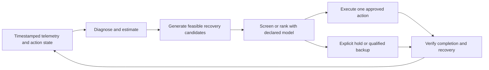

# Twin-in-the-Loop: architectural investigation

**Research date:** 16 September 2026  
**Repository inspected:** `213c021a68540f1b27b65158b1083a61e16c55fb`  
**Inputs:** both attached briefs, current implementation, saved experiment records, and independently retrieved primary literature.  
**Verification:** the existing suite passes **107/107**. New, isolated investigation probes reproduced several defects while that suite remained green. Production code and existing reports were not changed.

## 1. The single most likely architectural root cause

**The structural mistake is treating a filter of proposed actions as if it supplies the recovery controller.** The twin answers “is this candidate worse than waiting over H?”, while no component reliably completes the separate obligation “find and execute a feasible repair that restores the measured service objective.” The gated LLM supplies no interventions in the saved sweep; the scripted policies in the supplied report worsen episode outcomes; some fault–action pairs cannot provide the claimed recovery under the implemented dynamics. Better rejection consequently tends to preserve inaction. The adjacent discipline is **supervisory control and runtime assurance**, which separates the nominal controller from its safety supervisor and provides an explicit backup controller under stated assumptions. Simplex and predictive safety filtering describe that separation; their safety/recoverability guarantees do not automatically guarantee restoration of your application SLO. Your fallback is no-op, without a demonstrated recovery property. **H1 is the directly reproduced cause of decision starvation; the broader architectural error is expecting successful screening to establish successful remediation.** This is the strongest synthesis of the evidence, not a claim that one code defect caused every symptom. [Simplex architectural report, pp. 3–4](https://www.sei.cmu.edu/documents/1146/1996_005_001_16463.pdf), [Wabersich and Zeilinger, predictive safety filter](https://arxiv.org/html/1812.05506).

An isolated gate is a legitimate research architecture. It becomes inadequate when the claim is autonomous recovery and the upstream recovery policy has not been qualified. Conversely, adding a capable planner will not validate a flawed plant model or repair a confounded evaluation.

### What this conclusion does and does not establish

- **Established:** the four-step harness permits valid information gathering to consume every possible decision turn. A controlled reproduction returns no-op without any malformed output.
- **Established:** several supposed remedies have incomplete, misleading, or broken operational semantics; details below.
- **Supported by the supplied experiments:** the tested gates have little demonstrated episode advantage over inaction on those controllers and workloads.
- **Not established:** that beneficial repairs do not exist, that reject-all is optimal, that 0.3 ticks is an attainable-performance ceiling, or that fault forecasting is the unique next fix.

The correct engineering obligation is an end-to-end chain: **a relevant failure changes a measurable signal; permitted information supports a repair choice; an available actuator changes the failure's consequences; and that change improves a stated objective over a stated timescale.** Passing schema, fork, and queue tests establishes none of those relationships by itself. Simulation engineering distinguishes implementation verification from conceptual and operational model validation. [Shao et al., NIST, verification and validation discussion, pp. 2–3](https://tsapps.nist.gov/publication/get_pdf.cfm?pub_id=902524).

## 2. Evidence audit: corrections before interpretation

I distinguish **reported** results from **reproduced** findings. The ten-seed limitations tables were supplied, but their referenced `scratchpad/lab6_limits.py` harness is absent from this checkout. I did not invent its configuration or claim to rerun those tables. The current default prediction horizon is 30 ticks; the supplied limitations study uses 20. The study uses 120-tick episodes; the saved sweep examined here uses 300. These are separate protocols.

### 2.1 The 96.8% no-op statistic uses the wrong population

The exact 1,628/1,682 count exists in `results/sweep/proposals.jsonl`, but it pools null, rule, and LLM arms:

| Saved arm | Agent | Proposal rows | No-op rows | Other proposals |
|---|---|---:|---:|---|
| A0 | Null | 900 | 900 | None |
| A1 | Rule | 360 | 328 | 7 restarts, 23 scales, 2 migrations |
| A2 | LLM | 60 | 42 | 17 restarts, 1 scale |
| A3 | Gated LLM | 300 | 300 | None |
| A4 | Gated rule | 62 | 58 | 3 restarts, 1 scale |

Thus **A2 is 70% no-op; A3 is 100%; combined LLM rows are 342/360 = 95%**. The 96.8% pooled statistic is not a model's decision rate. The saved call log also contains multiple model names and cached calls, without sufficient per-call experiment identity to attribute the pooled behavior to one model. These counts are an artifact audit, not a clean causal comparison between gates or models.

The two migrations in this file belong to **the rule arm**, not the LLM arm. The gated LLM's 300/300 no-op result remains decisive evidence that this arm cannot measure harmful-action screening.

### 2.2 Fresh probes

Run from the repository:

```powershell
.\.venv\Scripts\python.exe docs/research/audit_probes.py
.\.venv\Scripts\python.exe -m pytest -q
```

The probes use in-memory simulators and a fake tool-only client, with no live model calls. Full output is in [audit_probe_results.json](audit_probe_results.json); source is [audit_probes.py](audit_probes.py).

| Probe | Reproduced result | Interpretation |
|---|---|---|
| Four valid topology tool responses | Four steps, no malformed responses, `exhausted=true`, returned no-op | Failure to decide is converted into an action label |
| Healthy versus leaking service, matched seed, 60 ticks | Every emitted metric is identical; memory is 5 versus 125; leaking host uses 130 against capacity 100 | Leak changes hidden state without a scored performance consequence |
| Restart during that leak | Memory resets to 5, then grows to 7 and 9 on following ticks | Restart reclaims memory; it does not stop the scheduled cause |
| Migrate `svc0` from `edge0` to `edge1` | Host changes; route still ends at `edge0` | Placement and routing become inconsistent |
| Reroute using only gateway-to-host link | Semantic validator accepts it | The client-side path requirement is absent |
| Two overlapping node crashes | Node becomes healthy while second crash is active, then down after both end | Saved-state restoration is not compositional |
| Failed host link | Service p95 is 0, drops are 1; link latency remains 5 ms; tool reports `status=down` | Zero completed-request latency is not evidence of health; tools can distinguish link status |
| Crash with queued requests and zero new arrivals | Throughput 0, p95 0, drop rate 0, SLO compliant | Request accounting can call an outage healthy |
| Fidelity 0.8 versus 1.0 | Noise, lag, drift, forecast parameters differ | Equal aggregate outcomes do not prove mapping saturation |

The current topology has **17 nodes and 16 links**, forming a gateway-centered tree. The report's 17-link description is incorrect for this builder.

## 3. Ranked verdicts on H1–H7

Rank reflects relevance to producing an interpretable result, rather than the number of missing features.

| Rank | Hypothesis | Verdict | Decisive evidence |
|---:|---|---|---|
| 1 | **H1: shared reasoning/commit budget** | **Confirmed locally** | Last allowed tool call unconditionally continues; no terminal phase; reproduced failure |
| 2 | **H2: observation/action mismatch** | **Partially confirmed** | Memory is passively indistinguishable, but full observability claim is too broad; the leak also lacks an SLO consequence |
| 3 | **H6: CPU model and scale harm** | **Partially confirmed** | Scale reallocates fixed host CPU and retains idle allocations; real contention exists, but ordinary horizontal scaling is different |
| 4 | **H5: purely rejective gate** | **Partially confirmed** | Gate cannot search or supply recovery; separation is valid for gate research, insufficient for a recovery claim |
| 5 | **H3: timing and horizon** | **Partially confirmed** | Payback and forecast mismatch matter; fixed-sign pessimism and impossibility of fixed H are false; label horizon is confounded |
| 6 | **H4: free inaction** | **Partially confirmed** | Defaults and prompt favor holding; no-op already incurs continuing SLO loss |
| 7 | **H7: missing control discipline** | **Partially confirmed** | Action lifecycle and reconciliation are incomplete; rule cooldown/persistence and replica bounds already exist; windup/oscillation not established |

### H1 — Reserve a decision, not another arbitrary reasoning step

In [llm_agent.py](/F:/twin-in-the-loop/src/twinloop/agent/llm_agent.py:177), all model responses share the four-iteration loop. A tool response on the fourth iteration is allowed and its result can never be used by a fifth generation. Line 273 then manufactures `NoOp`. The recorded all-tool trace has precisely that signature. This is a deterministic interface failure even if each tool and parser is correct.

An additional isolated probe performed during the agent-framework audit used a fake client that emits four tool calls followed by a restart: budget four returned exhausted no-op; budget five returned the restart. This proves the harness mechanism, not that an extra real-model turn would choose a useful action.

**Established practice:** smolagents performs a separate final-answer generation when its step loop exhausts; LangGraph normally raises a recursion error and documents proactive routing using remaining steps. Liu et al.'s budget-aware tool-use study exposes remaining budget and requests a final answer after tool-budget exhaustion. These establish explicit finalization as a supported pattern; they do not establish a universal production standard or guarantee decision correctness. [smolagents official implementation](https://github.com/huggingface/smolagents/blob/main/src/smolagents/agents.py), [LangGraph recursion handling](https://docs.langchain.com/oss/python/langgraph/graph-api#recursion-limit), [Liu et al., §§5.1 and 6.2](https://arxiv.org/html/2511.17006v1).

**Minimum correction:** allow three exploration generations plus one terminal generation within the existing four-call budget, or explicitly fund a separate terminal call. On that turn, disable tool responses and constrain output to the action schema. Reserve wall time and tokens as well as a slot. Preserve distinct outcomes: deliberate hold, decision produced, parse failure, tool exhaustion, timeout, and gate exhaustion. A fallback may execute no-op while remaining a failed decision in the scientific record.

Increasing four to five without changing termination semantics only moves the failure boundary. Forcing a non-no-op would be wrong. Searches found no primary paper establishing the exact combination of six remediation action types, a short ReAct budget, and no-op fallback as a named failure mode. Six schemas also do not mean six concrete choices: targets, paths, replica changes, and rates expand the action space.

### H2 — The problem is diagnosis plus remediability, not a blanket observability theorem

Observability concerns reconstruction of hidden state from input/output histories. Fault diagnosability concerns whether faults can be distinguished from normal behavior or each other. Control of useful outputs can be possible without reconstructing every state; detectability is weaker than full observability. Therefore “you cannot control what you cannot observe” is an inadequate formal statement. [Åström and Murray, output feedback](https://www.cds.caltech.edu/~murray/FBS/Output_Feedback.html), [Sampath et al., diagnosability, IEEE TAC 1995](https://ieeexplore.ieee.org/document/412626/).

**What can be proved here:** under no-op and matched randomness, changing only leak-related memory produces identical emitted metric histories. No passive classifier using those histories can distinguish the two cases. The probe confirms this even after host memory exceeds capacity. This is a restricted indistinguishability result, not a full nonlinear/hybrid observability proof. Migration downtime and placement validity depend on memory, so active interventions could indirectly reveal it.

The brief overstates the observation interface in another way: `TickMetrics` contains **no node memory-utilization field**. The sanitized context contains service memory, which RuleAgent reads, but the LLM tools omit it. Conversely, LLM topology/node/link tools expose current up/down status. Assess the complete allowed interface, not only the initial summary.

| Fault | Existing useful signals | What is ambiguous or missing | Can the named action actually help? |
|---|---|---|---|
| CPU saturation | CPU utilization, queue, throughput, latency; current node status | Can resemble demand overload without offered-arrival rate and resource demand; model-specific status provides extra evidence | Migration requires spare destination capacity; local scale creates none |
| Traffic surge | Queue growth, CPU and successful throughput; drops | Successful throughput saturates and does not reveal offered demand; exact fault isolation is not guaranteed | Effective new capacity or feasible placement can help; shedding trades latency for drops |
| Node crash | Throughput collapse, drops, correlated cohost failures; node-down tool status | Summary alone can resemble link failure or inactivity | Failover requires healthy reachable resources; high-CPU predicates miss it |
| Link degradation | Elevated per-link latency, service loss/latency, topology | Service latency alone mixes network and queue delay | Reroute requires a genuinely alternative path, absent in this default tree |
| Link failure | Throughput collapse, drops; link-down tool status | At service level it can resemble node failure; link latency stays nominal in current code | No fixed-endpoint detour exists in the default tree; relocation plus route repair may be possible |
| Memory leak | No direct LLM-visible memory trend | Healthy/leaking histories are identical under passive continuation | Restart resets memory but leak resumes; memory pressure does not affect the scored SLO |

Thus node/link failure are **not globally undiagnosable** through current tools. Their absence from high-utilization rules is rule coverage failure. Memory leak is a more serious contract mismatch: adding a sensor alone cannot make restart improve the current objective. Choose and implement a defensible memory consequence, such as OOM termination or pressure-dependent service behavior, and specify whether restart reclaims accumulated memory or removes the cause. Alternatively exclude leak recovery from an SLO-remediation claim.

### H6 — `scale_service` is CPU redistribution on one host

Let available CPU be C, target replicas r, total colocated replicas R, and demand per request d. The implementation gives:

```text
target CPU before = C r / R
target CPU after  = C (r + delta) / (R + delta)
neighbor CPU multiplier = R / (R + delta)
service rate = allocated service CPU / d
```

With two equally weighted services, adding one target replica changes **50/50 to 66.67/33.33**. With no neighbor, scaling changes **100 to 100**. Idle and down neighbors still occupy denominator weight. The simulator never lends unused allocations to busy services. See [CPU allocation](/F:/twin-in-the-loop/src/twinloop/sim/engine.py:214) and [queue service](/F:/twin-in-the-loop/src/twinloop/sim/service.py:30).

Linux cgroup CPU weights distribute contested capacity among active groups and are work-conserving; quotas independently impose bandwidth limits. Kubernetes schedules against resource requests, permits use of spare CPU, and enforces CPU limits through throttling. Adding Pods does not guarantee more physical CPU, so noisy-neighbor harm is real. But the present action implements neither placement-aware scale-out nor work-conserving shares. [Linux cgroup v2 CPU controller](https://docs.kernel.org/admin-guide/cgroup-v2.html), [CFS bandwidth control](https://docs.kernel.org/scheduler/sched-bwc.html), [Kubernetes resource management](https://kubernetes.io/docs/concepts/configuration/manage-resources-containers/).

**Verdict:** scale harm is credible in kind but materially shaped by this model. Its dominance cannot be generalized to container orchestration. Either name the action host-local resource reallocation, or model replica placement, admission, startup/readiness, and work-conserving CPU allocation. Compare the alternatives without tuning parameters merely to make the twin look useful.

There is also only one `in_service` request per service. Replica count speeds that aggregate server instead of creating independent servers. This queueing approximation matters for latency distributions and is another reason to validate the resource abstraction before publishing operational scaling conclusions.

### H5 — Use the twin for planning if the claim is controller performance

The gate sees one offered candidate, compares it with hold, and returns a coarse reason. It cannot generate alternatives or find a beneficial first step in a multi-action recovery. A simulator can instead support candidate ranking, trajectory search, or short action sequences. MPC and POMCP provide established examples of planning through a model; predictive safety filters construct feasible backup trajectories rather than merely rejecting inputs. [Rawlings, Mayne and Diehl, MPC textbook](https://sites.engineering.ucsb.edu/~jbraw/mpc/MPC-book-2nd-edition-6th-printing.pdf), [Silver and Veness, POMCP](https://papers.neurips.cc/paper_files/paper/2010/file/edfbe1afcf9246bb0d40eb4d8027d90f-Paper.pdf).

**Two valid designs:**

1. **Gate study:** preserve an independent proposer and score every gate on an identical, preconstructed panel of state–action pairs. Separately evaluate closed-loop outcomes.
2. **Recovery study:** let a planner query the imperfect twin, enumerate parameter-bounded candidates, and execute the best feasible action or first step. Compare this against a non-LLM candidate enumerator using the same model and compute budget.

Planner access to the twin is not inherently contamination. It changes the research object to the combined planner–model–gate controller. Gate-only attribution becomes invalid when different fidelities also generate different proposals. Access to the test fault schedule, exact future workload tape, or evaluation labels would be privileged information and must remain separate. A planner may exploit the same model's errors, so its model's approval is not independent evidence of benefit.

### H3 — Cover payback and continuation; there is no magic horizon ratio

There are three clocks: one-tick simulation integration, ten-tick decisions, and H-tick prediction. H is not a count of decision cycles. Migration produces immediate negative effects before possible benefit; it is more than pure dead time.

An illustrative calculation makes the issue precise. Let c be incremental violation cost during action downtime d, b the subsequent benefit per tick, and R the remaining actionable fault duration:

```text
predicted incremental cost ≈ c - b * max(0, min(H, R) - d)
payback requires min(H, R) > d + c/b
```

This simplifying derivation assumes H is at least d and b is positive; for H below d, use only downtime cost accumulated within H. It is not a fitted model of your runs. Merely making H exceed downtime can still miss payback. Queue clearance, capacity redistribution, and continued controller actions complicate the actual curve.

MPC guidance chooses sample time and prediction horizon against the desired response and relevant constraints. A **single fixed horizon can be correct** over a specified operating regime. Terminal values/constraints or a suitable continuation can represent consequences beyond it. Action-specific horizons are optional; comparing raw cumulative costs over different durations would introduce another inconsistency. There is **no applicable theorem that a ten-tick interval violates a Nyquist relationship with a ten-tick actuator delay**. [MathWorks, choose sample time and horizons](https://www.mathworks.com/help/mpc/ug/choosing-sample-time-and-horizons.html).

**Refutation of a central H3 claim:** assuming a fault persists can make intervention look *too good*. If migration escapes the fault, its no-op baseline accumulates damage that would actually self-resolve. The action-minus-no-op prediction is then optimistic. Other fault/action interactions produce the opposite bias. Absolute pessimism about the network does not determine the sign of comparative action error.

Furthermore, removing the injector does not exactly mean “the degradation persists.” CPU reservations and down statuses freeze, but the leak's `on_tick` growth also stops. The two branches use a persistence approximation that behaves differently across fault types.

The proposed horizon sweep needs repair before interpretation: [counterfactual.py](/F:/twin-in-the-loop/src/twinloop/experiment/counterfactual.py:24) takes its **label horizon from the twin configuration**. Varying H changes what counts as true harm. The live controller also visits different states at different H. The reported recall gradient therefore does not isolate predictor-horizon quality.

### H4 — Inaction is favored, but it is not free in the scored objective

The prompt, fallback logic, and lack of a guaranteed terminal decision favor holding. That is real. However, the twin explicitly simulates no-op and counts its continuing SLO loss. Zero intervention charge is not zero state cost. The `ActionResult.cost` field is logged separately and is not added to the gate objective for **any** action.

Do not add an arbitrary no-op penalty. That can induce pointless actions while changing the metric to reward activity. If recovery delay, backlog, memory pressure, or resource expenditure matters, put the corresponding operational consequence into a stated objective and evaluate every policy against it. If all feasible repairs are worse than waiting, holding is correct.

The missing ingredient is a policy that seeks an achievable desired state and checks whether it was reached. Kubernetes's controller pattern explicitly reconciles current and desired state; it does not infer task success from absence of an accepted change. [Kubernetes controllers](https://kubernetes.io/docs/concepts/architecture/controller/).

### H7 — Prioritize missing lifecycle control over generic damping

| Mechanism | Actual status | What follows |
|---|---|---|
| Sustained-condition checks | Present in RuleAgent | Do not claim universally missing hysteresis/persistence |
| Cooldown | Present, 15 ticks, but starts on proposal | Correct lifecycle semantics before tuning duration |
| Pending-action exclusion | Present in RuleAgent; not uniformly enforced for LLM actions | Put shared actuator interlocks in the execution layer |
| Replica bounds / placement feasibility | Bounds and memory checks exist; CPU provisioning does not | Feasibility checks must match actual resource semantics |
| Recovery after transient fault | No rule restores prior replica/rate settings | Persistent intervention damage is plausible and testable |
| Oscillation detection | No measured oscillation supplied | It cannot explain an all-no-op trace |
| Integral anti-windup | No integral controller identified | Do not diagnose literal windup from repeated requests |
| Stability/recovery analysis | No end-to-end property established | Specify bounded recovery and constraint properties before selecting analysis machinery |

Production HPA uses tolerance, stabilization windows, scaling-rate policies, and readiness-aware metric handling. These mechanisms illustrate disciplined feedback, but their wall-clock defaults should not be copied into this simulation. [Kubernetes HPA algorithm and behavior](https://kubernetes.io/docs/concepts/workloads/autoscaling/horizontal-pod-autoscale/).

## 4. Additional flaws: the findings that most change the diagnosis

### 4.1 Your “oracle” is not an episode-performance upper bound

The existing scheduled rollout executes one action and then advances the simulator without the future controller. It evaluates a specified action/no-op continuation over H, not the optimal episode policy. Its exactness is conditional on that choice of objective and continuation.

Here is a counterexample with nonnegative costs:

| Choice | First tick | Second tick | Third tick | Episode cost |
|---|---:|---:|---:|---:|
| Keep waiting | 1 | 1 | 1 | **3** |
| Accept action | 0 | 2 | 2 | **4** |

A perfectly accurate H=1 gate approves the action. Assume its later costs are unavoidable: no subsequent allowed action can escape the changed state. Reject-all still wins over the episode. Nothing was predicted incorrectly; the comparison stopped too soon. Locally neutral actions can also change later proposals or leave persistent state changes.

Rename the arm **fault-schedule-aware H-tick gate**. A real upper bound must optimize over a policy class containing reject-all, with consistent future decisions and the full target objective. Consequently the report's statements that the twin “saturates the ceiling” and no improvement can exceed 0.3 ticks are unsupported.

### 4.2 Negative average action value does not imply reject-all is optimal

On a fixed panel, let positive D mean harm relative to hold. Nine actions with D=+10 and one with D=−20 give mean D=+7. Reject-all gives zero. An ideal selector accepts only the beneficial action and averages −2. Thus:

```text
E[D] > 0 does not imply E[min(D, 0)] = 0.
```

Moreover, the difference between two closed-loop episode means is not the mean causal effect of a shared action portfolio: the policies visit different states and generate different later candidates. Your ablation is valuable evidence about the **tested policies**. It does not establish a theorem about all predictive gates or identify a workload defect as the unique cause.

### 4.3 The reported FPR can reward rejection by generating its own easy negatives

An always-reject gate necessarily rejects **100% of safe non-no-op candidates**, when any exist. Yet the table reports 15.49% for the stub and 4% for the rule agent. These are not rates of preserving safe candidate repairs.

The stub denominator implied by 22/15.49% is 142. It exactly fits 22 safe non-no-ops + 46 initial no-ops + 74 rejection-generated no-op retries. The rule denominator similarly fits 5/125. The missing harness prevents verifying this precise reconstruction; the conditional 100% result follows from the gate definition regardless.

Count first-attempt eligible non-no-op candidates separately. Report retries and explicit holds separately. Distinguish beneficial actions from merely nonharmful/neutral ones. A gate should be assessed by **benefit preserved and harm prevented**, not only a confusion matrix diluted by holds it induces.

### 4.4 The fidelity treatment does not implement the named five independent concepts

Inspection of [fidelity.py](/F:/twin-in-the-loop/src/twinloop/twin/fidelity.py:38) shows:

- **“Staleness” attenuates current fault effects.** It multiplies present CPU reservation, excess memory, link-delay excess, and loss by a lag-dependent factor. It does not retrieve the state from t−lag. It cannot reproduce, for example, a delayed sensor still reporting a just-cleared outage.
- **“Observation noise” changes latent simulator parameters.** It is not a noisy measurement followed by state estimation. This can be a useful perturbation experiment, but it is a different treatment.
- **“Structural simplification” replaces exponential per-request work with its mean.** It leaves the queue machinery in place; this is a service-time-distribution simplification.
- The scalar changes several treatments together. It cannot identify which axis caused a decision error.
- At **f=0**, topology, actuator rules, present statuses, resource structure, and more remain. This is not an information-free twin.
- At **f=0.8**, noise and drift are 0.06, forecast error 0.08, and lag two ticks. At f=1 they are zero. The mapping **does not saturate at 0.8**; identical integer outcomes can arise from unchanged threshold crossings or insensitive cases.

Use accurate treatment names now. Implement real delayed observations and a state estimator only if those are the intended claims. Use single-axis interventions and selected interactions before interpreting a scalar score as physical fidelity.

### 4.5 Prediction inherits privileged random futures and latent state

[NetworkSim.fork](/F:/twin-in-the-loop/src/twinloop/sim/engine.py:372) copies arrival, service, and routing generator states. The twin begins from a full state clone, then degrades selected fields; the `obs` argument is unused when building it. At perfect settings and without relevant exogenous changes, exact prediction is substantially constructed into the experiment.

Paired random futures are useful for low-variance simulator comparisons, but an operational twin generally does not know exact future Poisson arrivals or service times. Separate two roles: the evaluator may use paired exogenous randomness to compare alternatives; the predictor should use only its declared information and forecasts. Otherwise “fault-blind” sounds more operationally restricted than it is.

The current random streams are also consumed according to actions: work is sampled when a request enters service, and route randomness can be skipped when loss is zero. A branch change can shift which request gets which random value. This is a well-defined coupled simulator experiment, but it is not automatically a replay of the same request-level external world. For that stronger claim, use request IDs and event-keyed random tapes, or average independent future scenarios. Common-random-number comparisons are established simulation practice, not by themselves a novel causal-labeling method. [Yang and Nelson, Operations Research 1991](https://doi.org/10.1287/opre.39.4.583).

### 4.6 Migration and routing violate the plant's own connectivity model

On completion, migration updates the host ID but never updates its route. Request handling checks the links named in that route but does not require that it reach the current host. A supposedly successful migration can therefore serve traffic through the old host's link. Meanwhile the collector's summary stores initial service hosts; after movement it can contradict the live topology tool.

The route validator checks a growing union of endpoints, not a continuous ordered path from the client's source to the current host. It accepts a single gateway-to-host link, omitting the client link entirely. A planner given more freedom could exploit these inconsistencies and appear more effective while making the model less valid.

Repair placement and route updates as one operation, or specify a real multi-step migration protocol; validate source, adjacency, endpoint, and link state; refresh telemetry's placement view. Then reassess the supposedly beneficial migrations.

Separately, the default topology is a tree, so a fixed source and fixed host have one simple path. Reroute is often **physically unavailable**, irrespective of the agent's intelligence. An action schema is not control authority. Add redundant links only for scenarios intended to test rerouting, and retain unrepairable cases explicitly.

### 4.7 Overlapping faults can create false recoveries and permanent phantom faults

Faults save the prior value and restore it at their individual end. With crashes [0,10) and [5,15) on one node, the first restores healthy at tick 10 while the second remains active. The second restores its saved down state at tick 15, after both have ended. The probe reproduces both errors.

This is a local implementation defect with experiment-wide consequences, particularly with 15 scheduled faults per short episode, where same-target overlaps may occur. Compute effective state from baseline plus active fault contributions, or define explicit composition and precedence. Do not use old snapshots as independent undo records for overlapping modifications. Rerun affected data after correction; present accuracy against the old simulator is not protection against this error.

### 4.8 The metric does not conserve requests and can hide outage damage

The headline is **service-violation-ticks**: the evaluator adds one for each violating service each tick. Its maximum is six times episode length, not episode length. State that unit in every table.

More serious details in [engine.py](/F:/twin-in-the-loop/src/twinloop/sim/engine.py:291):

- Migration/restart clear queued and in-service requests before the next tick without incrementing a request-loss counter for those cleared requests.
- Crash handling can divide drops from an old queue by this tick's arrivals, allowing a drop rate above one; when arrivals are zero it sets the rate to zero even if queued requests were discarded.
- p95 is zero when no requests complete. The probe can therefore report a stopped service as compliant with zero throughput and lost queued work.
- Per-tick p95 uses only successful completions. Queue waiting that has not yet completed, and requests pending at episode end, can escape the metric.
- A binary service-tick score gives the same tick cost to mild threshold exceedance and total outage. Summing services can also permit one service's degradation to offset another's improvement.

Use cumulative/cohort-consistent accounting for generated, admitted, completed, dropped, and outstanding requests, with explicit timeouts and measurement windows. Keep undefined latency distinct from zero. Preserve per-service outcomes and outage duration alongside aggregate cost. Google SRE treats traffic, errors, latency, and saturation as separate signals, including different treatment of successful and failed request latency. [Monitoring distributed systems](https://sre.google/sre-book/monitoring-distributed-systems/).

There is also a boundary convention discrepancy: pending effects advance before service processing, so configured three-tick restart produces two fully unavailable service-processing ticks; ten-tick migration produces nine. Resolve or document the convention before fitting payback horizons.

### 4.9 Rejection changes hidden controller state before any actuation

[RuleAgent.decide](/F:/twin-in-the-loop/src/twinloop/agent/rule_agent.py:53) starts cooldown when it **proposes** an action. Gate rejection therefore suppresses later proposals despite no applied change. Every retry also adds a same-tick memory sample, interfering with the strictly increasing trend detector. Its memory “window” is measured in calls, whereas sustained CPU/latency checks use tick-level histories.

Separate proposal throttling from execution cooldown, and update each only on its intended event. Record observations once per timestamp. Give every controller the same structured requested/applied/completed/failed action history. The graph's `exhausted` field currently describes outer rejection exhaustion; it does not automatically preserve the LLM's inner exhaustion trace. A successful fallback can conceal the failure that produced it.

### 4.10 Temporary faults meet persistent interventions with no restoration policy

Replica counts, rate limits, and routes persist after the injected fault ends. The rule policy only scales up; it has no recovery/downscale rule. The schema permits negative replica changes, but the policy never requests them. No explicit remove-throttle action exists.

Consequently “do nothing” after a bad scale means **keep the damaging allocation**, not restore the pre-action state. This is a concrete mechanism that can explain long-lived harm and a reject-all advantage. Measure pre-fault, fault-active, and post-fault losses before assuming the benchmark simply needs more persistent faults. Desired-state reconciliation and rollback/cleanup belong in the controller design.

### 4.11 Experiment identity is too weak for mixed-model conclusions

Resume keys contain only `(arm, seed, fidelity)`. They omit model, prompt, horizon, thresholds, topology/fault configuration, code revision, and continuation policy. Reusing an output directory after such changes can skip runs that should be regenerated. The saved sweep contains heterogeneous model-call records; the available logging does not justify a single-model interpretation.

Use a configuration/code digest, unique run ID, and per-call episode/decision/proposal IDs. Archive the actual harness and resolved configuration beside each dataset. This is a specific reproducibility defect, not a request for indiscriminate extra logging.

## 5. Architectural errors versus local implementation fixes

| Finding | Classification | Required response |
|---|---|---|
| Safety/improvement veto used to support recovery claims | Architectural | Separate recovery competence from screening and establish both |
| No fault–signal–actuator–objective contract | Architectural/model validity | Prove recoverable scenarios and mark unobservable/unrepairable cases |
| Shared tool/commit budget | Local manifestation of an interface design flaw | Mandatory terminal phase and explicit outcome type |
| Missing memory field; missing down-state rule | Local interface/rule defects | Emit a legitimate sensor and use appropriate predicates; not sufficient to fix memory dynamics |
| Scale is host-local weight redistribution | Model abstraction choice | Rename scope or change resource model; validate either choice |
| Finite-H labels treated as episode effects | Evaluation design flaw | Declare continuation and horizon; separate local and episode estimands |
| Fidelity sweep changes labels and trajectories | Experimental design flaw | Fixed label target and fixed candidate panel; separate policy study |
| Staleness modeled as attenuation | Treatment validity flaw | Rename treatment or implement genuine delayed observations |
| Migration routes, fault overlap, drop accounting, time boundary | Implementation defects | Fix and regenerate affected evidence |
| Proposal-time cooldown and duplicate observations | Controller state-management defect | Event-based lifecycle updates |
| No post-fault restoration | Architectural policy omission | Reconcile desired resource and routing state after recovery |

The existence of local defects does not negate the structural diagnosis. It does refute the assumption that 107 passing tests have already verified every relevant component behavior.

## 6. Minimum changes, in order of expected impact

### Priority 1 — Establish trustworthy recovery opportunities and accounting

Before spending on another live sweep, repair fault composition, routing/placement consistency, and request accounting. For each fault included in the recovery claim, create one isolated observable scenario and demonstrate a feasible action/sequence that improves the **prespecified recovery or episode objective** compared with holding. Report its local-H costs and payback separately; a useful sequence may begin with a locally costly action. Use operational sensors, not fault labels. Include negative controls where intervention is inappropriate or impossible.

Resolve memory semantics, tree rerouting feasibility, and what scale means. An offline full-state candidate enumerator can diagnose whether opportunity exists; it must be labeled privileged and must not become the deployed agent. A sensor-limited scripted controller should demonstrate that the opportunity is actually accessible.

**Predicted symptom change:** leak repair either gains a genuine measurable purpose or leaves the benchmark; impossible reroutes are recognized; migrations become physically coherent; fault overlaps stop manufacturing outcomes. If no admissible repair helps even then, a workload/action-space limitation is supported. If an enumerator finds benefits the agent misses, the problem is the controller. This distinction should precede changing the workload to manufacture upside.

### Priority 2 — Make every LLM decision terminate explicitly

Reserve the terminal phase at a matched total budget, return typed decision outcomes, retain exhaustion provenance, and enforce a shared pending-action guard. Carry relevant tool evidence into same-tick retries rather than restarting investigation from scratch.

**Predicted symptom change:** the four-tools-then-default trace disappears as an unmarked success. Deliberate no-op may remain common. Meaningful success is a higher valid-decision rate followed by beneficial proposals on Priority 1 cases, not merely more interventions.

### Priority 3 — Freeze the target and build two separate experiments

1. **Predictor/gate experiment:** a fixed corpus of snapshots and feasible non-no-op candidates, with beneficial, neutral, and harmful labels; fixed evaluation horizon, continuation, and harm definition; identical examples at every fidelity. Retain a representative natural-mixture set separately from deliberately balanced diagnostic cases.
2. **Closed-loop controller experiment:** paired full episodes with null, qualified nominal controller, reject-all, useful domain rules, twin-gated nominal controller, and optionally model-planning controller. Each policy keeps its own trajectory; report that total system effect explicitly.

Align gate tolerance and harm threshold when claiming classification accuracy, or explicitly report the 0-to-3-tick gray zone. Do not silently increase tolerance to improve FPR: that changes accepted operational harm. Keep rejection loss, severity, and per-service effects visible.

**Predicted symptom change:** reject-all exposes 100% overblocking of beneficial eligible candidates; fidelity trends stop being driven by changing label definitions and no-op retries; any remaining predictive benefit is interpretable.

### Priority 4 — Provide an actual recovery policy and verify completion

Use a deterministic, observation-limited candidate generator as the first competent baseline. For this parameter-bounded action space it is also a useful comparator to LLM selection. Track lifecycle events, update cooldown after the intended execution/completion event, and restore temporary resource/routing changes after fault recovery.

The LLM can propose candidate repairs or explain diagnoses. It need not supply every scheduling and resource-feasibility decision. If twin queries are enabled, declare that as a separate planning arm and equalize query budgets.

**Predicted symptom change:** retries sometimes produce another feasible repair; lingering post-fault damage decreases; the controller shows benefit over null on held-out recoverable scenarios. If only a privileged oracle can do so, the observation model still needs work.



This is a proposed architecture. A qualified backup has a stated domain and property; it is not assumed universally safe merely because it is deterministic. An SLO that cannot be met under a fault/resource configuration should be reported as infeasible.

### Priority 5 — Tune timing and uncertainty against the corrected target

Choose H against measured action payback and persistent effects; evaluate suitable terminal continuations. Freeze H for labels while sweeping predictor H. Distinguish fault onset from clearance and test uncertainty over remaining fault life. A predictor trained on permitted history is legitimate; feeding it the test schedule is not.

Implement genuine delayed-state experiments if staleness is a research claim, and independently resample future uncertainty for the predictor where appropriate. Start with simple persistence, duration-distribution, and scenario-ensemble baselines before an elaborate fault-arrival model.

**Predicted symptom change:** delayed benefits and post-action harms are recognized more consistently; model error is attributed to explicit uncertainty sources. There is no reason to predict monotonic recall or precision in advance.

### Priority 6 — Replicate under a prespecified claim

Archive resolved configs, code revision, model/provider, seeds, prompts, action provenance, and unique run IDs. Report paired per-seed episode differences and uncertainty intervals; treat the seed/episode as the independent unit, not each retry. Set a practically meaningful effect threshold and plan sample size around it. Fifty or one hundred seeds is a budget choice, not a statistical guarantee; Wilcoxon is not automatically appropriate for every difference distribution.

Keep the original representative workload. Any new persistent-fault or cheaper-migration scenario must be justified as a separate regime, not substituted because it yields a favorable result.

## 7. What you are actually measuring

The current local quantity is approximately:

```text
D_H(s,a) = L_H(s; apply a, then no further control,
                   scheduled faults and cloned RNG)
         - L_H(s; hold, then no further control,
                   scheduled faults and cloned RNG)
harmful = D_H > harm_threshold_ticks
```

The twin estimates a related quantity using perturbed full state and a disabled injector, then approves when its estimated delta is at most tolerance. The real episode invokes the controller repeatedly. These are different objects.

| Intended interpretation | What the current measurement supports |
|---|---|
| LLM judgment under risk | A mixture of model outputs, harness exhaustion, parser outcomes, caches, and defaults unless provenance is separated |
| Gate classifier quality across fidelity | Policy-dependent populations with changing states, retries, and sometimes label horizons |
| Harmful versus safe repair | More than three additional service-ticks versus its H-tick no-control continuation; “safe” includes small harms and neutral actions |
| Absolute safety | Relative predicted non-worsening; both branches can violate SLO throughout |
| True effect of rejected actions | Exact synthetic branch difference under one stated coupling, horizon, metric, and continuation |
| Production twin fidelity | Sensitivity of one simulator to selected latent perturbations and service-time simplification |
| Horizontal scaling | Redistribution of a fixed host's CPU among colocated weights |
| Migration downtime risk | Incompletely accounted queue loss and potentially inconsistent routes |
| Recovery effectiveness | Full-episode policy outcome only when compared on valid, paired scenarios with a correct objective |

Useful metrics for the corrected **fixed panel** are:

```text
benefit preserved = sum(max(-D,0) for approved candidates)
                  / sum(max(-D,0) for all candidates)
harm prevented   = sum(max(D,0) for rejected candidates)
                  / sum(max(D,0) for all candidates)
```

Report these as local opportunity-weighted quantities; they are not sums of actual closed-loop episode effects. A zero denominator is “not estimable,” not a perfect score. Add delta prediction error, decision-margin errors, safe/beneficial-candidate rejection, and full-episode service loss, outage duration, completion rate, and post-fault residual harm.

The report's rule table does numerically beat no-op, 130.2 versus 130.5. The defensible statement is that a **material, generalizable advantage has not been demonstrated**, not that the table shows no improvement at all. Likewise, equality of rounded means does not imply equality of decisions or an exhausted performance ceiling.

## 8. Production practice and the literature: what transfers

### 8.1 Production diagnose–decide–act loops

| Practice | Relevant lesson for this system |
|---|---|
| Kubernetes desired-state reconciliation | Specify a target, apply changes, and observe actual state again; lifecycle state belongs in the controller |
| Kubernetes liveness/readiness/startup probes | Reachability and ability to serve are distinct from utilization; restart and traffic exclusion have different purposes |
| HPA stabilization and readiness handling | Wait for meaningful effects, bound rates, and account for missing/startup measurements |
| EC2 Auto Scaling health replacement | Recover desired capacity from explicit health signals; failed-instance replacement is not just another high-CPU rule |
| SRE overload/recovery engineering | Account for cohost/downstream effects and the risk that protective behavior sustains a cascade |
| Network SON coordination | Coordinate interacting control loops and shared resources; locally sensible actions can conflict |

These are concrete precedents, not evidence that any named platform implements your proposed LLM/twin combination. Sources: [Kubernetes probes](https://kubernetes.io/docs/tasks/configure-pod-container/configure-liveness-readiness-startup-probes/), [EC2 health checks](https://docs.aws.amazon.com/en_en/autoscaling/ec2/userguide/ec2-auto-scaling-health-checks.html), [EC2 cooldown and warmup distinctions](https://docs.aws.amazon.com/autoscaling/ec2/userguide/ec2-auto-scaling-scaling-cooldowns.html), [Google SRE cascading failures](https://sre.google/sre-book/addressing-cascading-failures/), [Tall et al., coordination of self-organizing network mechanisms](https://arxiv.org/abs/1309.5067).

### 8.2 Fidelity versus decision effectiveness has precedents

- **Su, Hicks and Nassehi:** the cited extrusion-failure paper is authentic and studies fidelity versus detection. Its abstract reports that some lower-fidelity twins match higher-fidelity detection. It supports task-specific fidelity, not universal monotonic improvement. Online publication was 2023; the volume is 2024. Full article tables were subscription-restricted in this audit. [Publisher page](https://link.springer.com/article/10.1007/s10845-023-02144-x).
- **Janner et al., MBPO:** theoretical and experimental work studies model-induced bias and the usefulness of short rollouts. It supports examining prediction length against model error, but its learned-model RL results do not determine your numeric H. [NeurIPS 2019 paper](https://papers.neurips.cc/paper/9416-when-to-trust-your-model-model-based-policy-optimization.pdf).
- **Value equivalence:** a model's usefulness for planning depends on preserving the relevant value computations, not reproducing all dynamics equally accurately. [Grimm et al., NeurIPS 2020](https://papers.neurips.cc/paper_files/paper/2020/hash/3bb585ea00014b0e3ebe4c6dd165a358-Abstract.html).
- **Predictive safety filters and model predictive shielding:** forward simulation, uncertainty, and backup recoverability already underpin action-screening research. Their guarantees require explicit assumptions absent from a relative SLO veto. [Bastani, model predictive shielding](https://arxiv.org/abs/1905.10691), [robust shielding](https://arxiv.org/abs/1910.10885).

For your gate, model error matters chiefly when it crosses the decision margin `D − tolerance`. Common error in both branches may cancel; a tiny delta error near the threshold can reverse approval. That is a more informative experimental object than a presumed monotonic fidelity score.

### 8.3 Audit of the earlier base-paper report

All nine cited identifiers resolve to authentic papers. **The central issue is interpretation, not invented citations.** The detailed audit and access limitations are in [literature_audit.md](literature_audit.md).

| Earlier claim | Verified correction |
|---|---|
| Aether has 88 synthetic scenarios and establishes production deployment | It reports eight synthetic scenarios with variants/repetitions, plus incident cases on an ISP laboratory replica; deployment approval is human |
| Aether implements emulation | Its emulation support is planned; NSO ingestion is not evidence of implemented emulation |
| Process-plant paper has no quantitative data | Tables report correct/incorrect/missed actions, reprompts, and token use, within a narrow scenario |
| Every checked guard paper neglects trivial blocking and lost utility | NetInjectBench explicitly tests a high-impact-tool blocker and approved-change utility; this directly contradicts the report |
| SLGuard's 11-to-4 result is comparable to SLO ticks | It is a small selected-case mitigation result, with a different label and population |
| State–action safety classification is a new contribution | Existing shielding work explicitly defines ground-truth state–action labels and binary shields |
| Counterfactual fork capability establishes first-ever novelty | Paired simulation and rollout comparisons are established; exact combination novelty remains unproven |

Aether's reported detection, precision, and timing figures largely match the supplied numbers, but its task and population differ. A toy simulator's 81 ms and an LLM-driven configuration-validation workflow's hundreds of seconds do not establish a performance victory. Nor do matching metric names make their precision values comparable. [Aether, full text](https://arxiv.org/html/2604.18233v1).

The process-plant paper is the closest proposal–simulation–reconsideration architecture. It also uses fault information and has a force-execution fallback after retries, so it is not your sensor-limited safe-fallback protocol and should not be copied uncritically. [Process-plant paper, Algorithm 1 and evaluation](https://arxiv.org/html/2505.02076v1).

NetInjectBench reports that indiscriminate blocking loses approved-change usefulness, alongside its safety results. AgentDojo likewise reports utility and attack success. These are different safety domains, but they disprove a broad claim that guardrail research ignores usefulness. [NetInjectBench](https://arxiv.org/html/2607.10490v1), [AgentDojo official results](https://agentdojo.spylab.ai/results/).

For methodological lineage, Shperberg et al. explicitly model a shield as a classifier over state–action safety labels and discuss observation aliasing and classification errors. Their safety label differs from your paired SLO delta, so the exact experimental combination still needs a targeted novelty review. [A Rule-based Shield, §§3.1–3.2](https://proceedings.mlr.press/v199/shperberg22a/shperberg22a.pdf).

**Recommended positioning:** use the process-plant work and predictive safety filtering as architectural foundations; Aether as a network-domain comparator; and shielding/paired simulation as methodological precedents. A defensible contribution is a reproducible testbed showing **when imperfect model predictions preserve useful repairs, prevent harm, and disagree with full-episode outcomes**. It does not require claiming a new general guardrail principle or superior production-network performance.

## 9. What would falsify this diagnosis?

The architectural diagnosis would weaken if a correctly instrumented, observation-limited ungated controller already produced reliable held-out recovery benefits, while an otherwise identical gate consistently removed them. That would locate the main defect in validation. Conversely:

1. If terminal finalization restores decisions but no feasible candidate improves the corrected objective, the plant/action/workload contract is the limiting factor.
2. If feasible candidates exist and an observation-limited scripted policy finds them while the LLM does not, diagnosis/action selection is the limiting factor.
3. If a fixed-panel twin misranks candidates that the exact local evaluator labels correctly, prediction is the limiting factor.
4. If local labels are accurate but episodes worsen, continuation, persistent interventions, or objective/horizon mismatch is the limiting factor.
5. If observed benefits vanish after routing, fault-composition, and request-accounting fixes, the earlier gain was dependent on simulator defects.

These experiments discriminate causes. More prompt tuning, more fidelity, or more seeds on the current mixed design would not.

## Supporting artifacts

- [Reproducible investigation probes](audit_probes.py) and [captured results](audit_probe_results.json).
- [Control theory and model-based planning sources](control_sources.md).
- [Agent framework, resource allocation, and production-practice sources](agents_resources_sources.md).
- [Full citation and inference audit](literature_audit.md).

**Limits:** current-code findings and fresh probes are reproduced; supplied ten-seed tables are not independently regenerated because their harness is absent. No live model sweep or physical-network experiment was run. Formal global observability, stability, and optimal-policy proofs were not established. Those limits do not affect the reproduced budget, telemetry, routing, fault-overlap, and metric findings.
